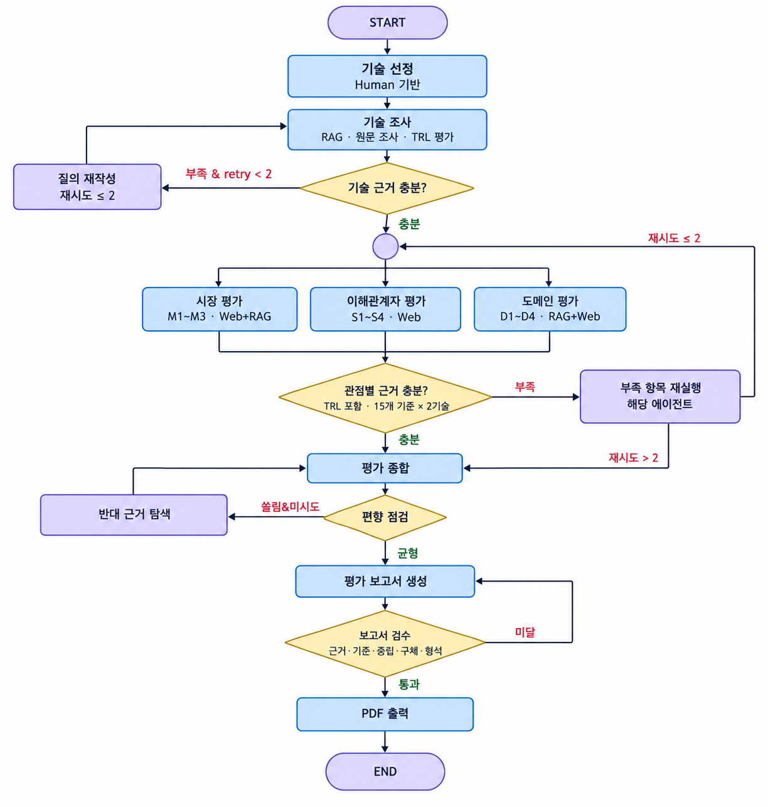

# TechEvalAgent

KV cache 최적화 기술을 소프트웨어와 하드웨어 진영에서 하나씩 선정하고, **기술 성숙도·시장성·이해관계자·도메인 적합성**의 네 관점으로 평가하는 Agentic RAG 시스템입니다.

평가 대상은 대규모 데이터센터의 장문맥 LLM 추론 환경입니다. DeepSeek-V2 MLA와 CXL-enabled PIM/PNM의 기술 성숙도, 시장성, 이해관계자 영향, 도메인 적합성을 근거와 함께 분석하고, 관점별 평가가 달라지는 이유를 설명한 보고서를 제공합니다.

## Overview

| 항목 | 내용 |
|---|---|
| Objective | 서로 다른 KV cache 최적화 접근을 동일한 기준으로 다관점 평가 |
| Method | LangGraph Multi-Agent + 논문 RAG + Web Search + 근거 검증 루프 |
| Input | 논문 코퍼스, 공개 구현·벤더·시장 자료 |
| Output | 논문·웹 근거가 연결된 기술 비교·분석 보고서 (Markdown 및 PDF) |
| Evaluation | 기술 성숙도, 시장성, 이해관계자, 도메인 적합성의 15개 세부 기준 |

## Selected Technologies

| 진영 | 선정 기술 | 선정 사유 |
|---|---|---|
| SW | **[DeepSeek-V2 MLA](https://arxiv.org/abs/2405.04434)** | 사후 양자화와 달리 KV 생성 단계부터 저차원 latent vector를 저장하는 attention 구조. 데이터량 자체를 줄이는 모델 구조의 대표 사례. KV cache 93.3% 감소와 최대 생성 처리량 5.76배를 통한 정확도·비용·모델 변경 범위 평가 가능성. |
| HW | **[CXL 기반 PNM KV Cache 관리](https://arxiv.org/abs/2511.00321)** | CXL 외부 메모리 확장과 PNM 기반 KV 페이지 선택·attention 연산의 결합. 용량뿐 아니라 GPU와 외부 메모리 간 데이터 이동·대역폭 병목을 함께 다루는 하드웨어 접근. |

DeepSeek-V2 MLA의 **KV cache 축소 모델 구조**와 CXL 기반 PNM KV Cache 관리의 **메모리 근처 대용량 KV cache 처리**라는 대비.

## Key Features

- **Structured Paper RAG**: PDF의 페이지·절·표 단위 청킹 및 원문 위치 메타데이터 보존
- **Hybrid Retrieval**: BGE-M3 dense retrieval, BM25 keyword retrieval, RRF(`k=60`) 결합
- **Cross-lingual Search**: 한국어·한영 혼용 질의 기반 영문 논문 검색
- **Evidence Validation**: `chunk_id`, quote, URL, 평가 단위, 신뢰도 검증 및 부족 기준 재검색
- **Bias Control**: 근거 비대칭 또는 반대 근거 누락 시 Web Search와 survey RAG 추가 수행
- **Report Generation**: 검증된 Evidence 기반 Markdown·PDF 보고서 생성

## Tech Stack

| 구분 | 기술 |
|---|---|
| Framework | LangGraph |
| LLM | Agent별 환경변수 기반 모델 설정 |
| Retrieval | ChromaDB + BM25 + RRF |
| Embedding | BAAI/bge-m3 |
| Report | Markdown, WeasyPrint PDF |

| 구분 | 모델 설정 |
|---|---|
| 기술 조사·TRL Agent | `LLM_MODEL_TECH_RESEARCH` → 미설정 시 `LLM_MODEL` (`gpt-5-mini`) |
| 도메인 적합성 Agent | `LLM_MODEL_DOMAIN` → 미설정 시 `LLM_MODEL` (`gpt-5-mini`) |
| 시장 Agent | `LLM_MODEL_MARKET` → 미설정 시 `LLM_MODEL` (`gpt-5-mini`) |
| 이해관계자 Agent | `LLM_MODEL_STAKEHOLDER` → 미설정 시 `LLM_MODEL` (`gpt-5-mini`) |
| 종합 Agent | `LLM_MODEL_SYNTHESIS` (`gpt-5-mini`) |
| 보고서 Agent | `LLM_MODEL_REPORT` (`gpt-4o`) |
| 보고서 Judge | `JUDGE_MODEL` (`gpt-5-mini`) |

## Agents

| Agent | RAG | 역할 |
|---|:---:|---|
| 기술 조사·TRL Agent | O | 기술 원리·실험 조건·공개 구현 자료 기반 T1~T4 및 기술 프로필 생성 |
| 시장 Agent | O | 웹 중심 M1~M3 평가 및 논문 RAG 기반 기술 사양 교차 확인 |
| 이해관계자 Agent | X | 웹 검색 기반 이해관계자 역할·편익·부담·상충 S1~S4 평가 |
| 도메인 적합성 Agent | O | 논문 실험 조건과 공식 웹 자료 기반 D1~D4 평가 |
| 종합 Agent | X | 추가 검색 없는 네 관점의 합의·상충·공백 종합 |
| 보고서 Agent | X | 검증된 State·Evidence 기반 챕터별 보고서 작성 |

## Architecture



## Project Structure

```text
TechEvalAgent/
├── data/
│   ├── papers/               # PDF 출처·파일명 안내, 로컬 원문 위치
│   └── chroma/               # Chroma + BM25 생성 결과 (Git 제외)
├── docs/                     # 계약, 평가 기준, 역할별 구현 명세
├── scripts/
│   ├── ingest.py             # PDF → Chroma/BM25 인덱싱
│   └── run.py                # 전체 LangGraph 실행
├── src/techeval/
│   ├── agents/               # 평가·종합·보고서 Agent
│   ├── control/              # 재검색·검증·Judge 제어 노드
│   ├── prompts/              # Agent별 프롬프트
│   ├── report/               # 인용·표·린트·PDF 렌더링
│   ├── retrieval/            # parser·embedding·Chroma·BM25·RRF
│   ├── tools/                # Web Search 및 stub
│   ├── graph.py              # LangGraph StateGraph
│   └── schemas.py            # 공통 Pydantic 계약
├── tests/                    # fixture, Agent, control, retrieval, report 테스트
├── outputs/                  # report, web cache, state dump (Git 제외)
└── .env.example
```

## Usage

아래 순서대로 실행하면 실제 논문 코퍼스, LLM, Web Search를 사용하는 전체 파이프라인 재현 가능.

### 1. 의존성 설치

```bash
uv sync
```

### 2. 환경변수 설정

```bash
cp .env.example .env
```

`.env`에서 `LLM_PROVIDER`, `OPENAI_API_KEY`, `LLM_MODEL`, `JUDGE_MODEL`, `WEB_SEARCH_PROVIDER`, `WEB_SEARCH_API_KEY` 설정 필요.

### 3. 원문 PDF 준비

원문 PDF 4편의 `data/papers/` 배치. 파일명과 출처는 [`data/papers/README.md`](data/papers/README.md) 참고.

### 4. 로컬 검색 인덱스 생성

```bash
uv run python scripts/ingest.py --papers-dir data/papers --chroma-dir data/chroma --rebuild
```

### 5. 전체 파이프라인 실행

```bash
uv run python scripts/run.py --dump-state
```

실행 결과: `outputs/report.md`, PDF 렌더링 성공 시 `outputs/report.pdf`, `--dump-state` 사용 시 `outputs/state/`.

### 개발·데모 실행

검색기·웹 검색·LLM은 stub으로 대체하고 실제 Agent 코드와 그래프 흐름을 확인하는 명령.

```bash
uv run python scripts/run.py --stub-deps --skip-pdf
```

## Contributors

| 이름 | 담당 |
|---|---|
| 강준모 | Market·Stakeholder Agent, Web Search |
| 김가연 | Synthesis·Report Agent, 인용·PDF |
| 노윤성 | Tech Research·TRL Agent, Domain Agent |
| 백승현 | 공통 계약·State, LangGraph 제어·통합 |
| 이지수 | PDF parsing·chunking, BGE-M3·Chroma·BM25 Retrieval |
| 장민서 | 프로젝트 기획·기술 선정·평가 설계 |
