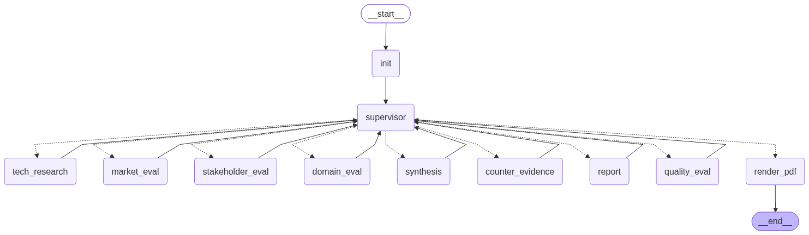
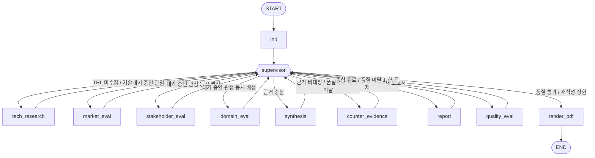

# Subject

본 프로젝트는 KV cache 최적화 기술을 소프트웨어·하드웨어 두 진영에서 하나씩 선정하여,
기술 성숙도·시장성·이해관계자·도메인 적합성 관점에서 평가하는 **Supervisor 패턴** 기반으로 설계/개발한 프로젝트입니다.

> 이 브랜치(`agent/supervisor`)는 RAG 실습 때 만든 고정 순서 그래프를 Agent 실습 과제에 맞춰 Supervisor 패턴으로 재구성한 버전입니다.
> 에이전트·검색기·근거 검사 함수는 `main`과 같고, 그래프 연결·State·품질 평가 노드가 바뀌었습니다. 전체 설명은 `main` 브랜치 README를 참고하세요.

## Overview

- **Objective** : 하나의 기술을 복수 관점에서 비교 평가 (우열 판정이 아니라 관점별로 평가가 달라지는 이유를 설명)
- **Pattern** : **Supervisor** — 기존 코드에 이미 있던 근거 충분도 검사(기술 근거·관점별 근거·근거 비대칭)와 재작업 루프가 Supervisor의 "근거가 충분한지 판단 → 부족한 하위 에이전트에 재작업 요청" 역할과 그대로 맞물린다. 기술 조사(TRL) 결과가 있어야 관점 평가를 할 수 있는 의존 관계가 있어, 실행 전에 한 번에 분해하는 Orchestrator-Workers보다 상태를 보며 다음 담당을 정하는 Supervisor가 적합하다.
- **동적 처리** : 실행 순서를 코드에 고정하지 않는다. `supervisor`가 매 판단마다 현재 State(어떤 관점이 수집됐는지, 근거가 충분한지, 재시도가 몇 번 남았는지, 근거가 한쪽에 쏠렸는지)를 보고 `add_conditional_edges`로 다음 담당을 고른다. 기술 조사(TRL)를 먼저 배정하는 것은 순서 고정이 아니라 데이터 의존(도메인 평가가 기술 프로필을, 모든 관점이 TRL 결과를 입력으로 받음) 때문이고, 서로 의존이 없는 시장·이해관계자·도메인은 State상 대기 중(미수집 또는 근거 부족)이면 한 번의 판단으로 함께 배정한다. 같은 입력이라도 근거 검사 결과에 따라 재작업 대상·횟수, 반대 근거 탐색 여부, 보고서 재생성 여부가 달라진다. 종료는 단계 수가 아니라 상한(재시도 상한·`MAX_SUPERVISOR_STEPS`·`recursion_limit`)으로 보장한다.

## Selected Technologies

- **SW** : [DeepSeek-V2 MLA](https://arxiv.org/abs/2405.04434) — KV를 저차원 latent vector로 저장해 KV cache 자체를 줄이는 모델 구조의 대표 사례 (KV cache 93.3% 감소, 최대 생성 처리량 5.76배 보고)
- **HW** : [CXL 기반 PIM/PNM KV cache 관리](https://arxiv.org/abs/2511.00321) — CXL 메모리 확장과 메모리 근처 연산을 결합해 용량과 데이터 이동 병목을 함께 다루는 하드웨어 접근

## Features

- PDF 논문 4편(선정 논문 2 + 서베이 2)의 페이지·절·표 단위 청킹, BGE-M3 + BM25 하이브리드 검색
- Web Search(Tavily)로 시장·이해관계자·공개 구현 자료 수집, 출처 URL·확인일 기록
- 근거 검증: LLM이 인용한 `chunk_id`·URL이 실제 검색 결과에 있는지 코드로 확인. 못 찾은 정보는 추측하지 않고 `not_public`으로 기록
- **Supervisor 재작업 루프** : 근거가 부족한 기준만 골라 해당 하위 에이전트에 재작업 요청 (관점·기술별 최대 2회)
- **확증 편향 방지 전략** : 기술별 근거 수 비율(2:1 초과)·반대 근거 누락·벤더 자료 편중을 코드로 계산해, supervisor가 반대 근거 탐색(웹 + 서베이 RAG)을 배정. 품질 평가는 근거 확보 시도와 한계점 공개를 따로 확인
- **보고서 품질 평가** : 보고서 생성 후 Groundedness·중립성·편향 통제·관점 커버리지 4개 항목을 코드 검사 + LLM Judge(Hybrid)로 평가. 미달이면 supervisor가 원인별로 재작업 위치(조사 에이전트·반대 근거 탐색·보고서)를 고름
- 하위 에이전트 실패 시 그래프를 멈추지 않고 `node_status`·`last_error`에 기록 → 재작업 → 상한 도달 시 `not_public` 확정 (fallback)

## Tech Stack

- **Framework** : LangGraph (StateGraph, `add_conditional_edges`, `Send`, reducer), LangChain
- **LLM/Generator** : `gpt-5-mini` (기술 조사·관점 평가·종합), `gpt-4o` (보고서 작성)
- **LLM/Judge** : `gpt-5-mini` (`JUDGE_MODEL`, 보고서 생성 모델과 분리)
- **Retrieval** : ChromaDB + BM25, RRF(k=60) 결합 — 사전 실측(골든셋 24문항, 한/영 반반, 800자 청킹 기준) BGE-M3 Dense Hit@5 0.708·MRR 0.572, Hybrid(Dense 0.7) Hit@5 0.750·MRR 0.567
- **Embedding** : BAAI/bge-m3 (오픈소스, 한국어 질의 → 영문 논문 교차 언어 검색)
- **Observability** : LangSmith 트레이싱 (`trace_id`를 실행 메타데이터와 로그에 공통 기록)

## Agents

- **Supervisor** (`graph.py` · `supervisor`) : 현재 State로 다음 담당을 고르고, 근거 충분도를 코드로 판정해 재작업을 요청한다. 의견을 생성하지 않는다(판정은 결정론).
- **Tech Research Agent** : 기술 원리·측정 조건 프로필과 TRL(T1~T4) 평가. 논문 RAG + 공개 구현 웹 검색
- **Market Agent** : 시장성(M1~M3). 웹 중심 + 논문으로 기술 사양 교차 확인
- **Stakeholder Agent** : 4주체(모델 개발사·클라우드 운영사·메모리 벤더·투자 업계)의 이해관계(S1~S4)
- **Domain Agent** : 대규모 데이터센터 장문맥 추론 환경 적합성(D1~D4). 측정 조건 포함
- **Counter Evidence** : 근거가 한쪽에 쏠린 기준에 대해 반대 방향 근거 탐색 (supervisor가 필요할 때만 배정)
- **Synthesis Agent** : 관점 간 합의·상충·공백 종합
- **Report Agent** : SUMMARY~REFERENCE 보고서 작성, 품질 평가 미달 시 문제 챕터만 재작성
- **Quality Eval** (`control/quality_eval.py`) : 보고서 품질 4개 항목 평가

하위 에이전트는 모두 supervisor로만 돌아오며, 하위 에이전트끼리는 직접 연결되지 않는다.

## State Schema

State를 하나의 두꺼운 구조 대신 **제어 레이어(`ControlState`)와 페이로드 레이어(`PayloadState`)**로 나누고 `GraphState(ControlState, PayloadState)`로 합쳤다 (`src/techeval/state.py`). 하위 에이전트는 전체 State를 보지 않고 supervisor가 만든 `AgentInput`(담당 기술·부족 기준·이전 결과)만 받는다.

- **제어 vs 페이로드 분리** : 라우팅에 필요한 최소치(`next`, `dispatch`, `step_count`, `retry_counts`, `missing_criteria`, `synthesis_stale`·`report_stale`·`quality_pending`, `node_status`, `last_error`, `decision_reason`, `trace_id`, `source_urls`)만 `ControlState`에 둔다. supervisor 판단은 `SupervisorDecision`(Pydantic)으로 검증한 뒤 쓴다 — 허용되지 않은 action, 모르는 기술 ID, 담당 관점 밖의 기준을 배정하면 State에 쓰기 전에 막힌다. 라우팅 키는 supervisor가 쓰고, 하위 에이전트는 reducer 키(`node_status`, `last_error`)로 자기 상태만 보고한다. 평가 결과·종합·보고서는 `PayloadState`에 두고 각 에이전트가 자기 키에만 쓴다.
- **관측성 위치** : State에는 마지막 판단 사유 한 줄(`decision_reason`)만 둔다. 매 판단의 상세(어디로 왜 보냈는지)는 `[trace=…] supervisor #n → 담당 | 사유` 형식으로 logger와 LangSmith 트레이스에 남겨 State가 로그로 불어나지 않게 했다.
- **지속성 비용** : 검색 원문은 State에 넣지 않고 Evidence의 `chunk_id`·짧은 인용만 저장한다. 재작업으로 누적되는 평가 결과는 `latest_by_criterion`으로 최신본만 읽고, 근거 검사는 하위 에이전트가 막 돌아왔을 때만 실행해 보정 결과가 매 판단마다 쌓이지 않게 했다.
- **상관** : `trace_id`를 초기 State에 넣고, 같은 값을 실행 config 메타데이터(`run_name=TechEvalAgent-supervisor-<trace_id>`)와 모든 판단 로그에 기록해 State·로그·LangSmith를 잇는다.
- **재개/복구** : `scripts/run.py`는 SQLite checkpointer(`outputs/checkpoints.sqlite`, 선택 의존성 `langgraph-checkpoint-sqlite`)로 `thread_id=trace_id` 슈퍼스텝마다 State를 저장하고, `--resume <trace_id>`로 새 프로세스에서 이어서 실행한다. 근거 실존 검사(V5)에 쓰는 웹 검색 URL 목록도 State(`source_urls`)에 동기화해 재개 후 새 그래프에서 복원한다. `node_status`(`관점:기술` → assigned/done/error/exhausted)와 `last_error`로 어디까지 진행됐고 무엇이 실패했는지 남기며, 실패한 작업은 supervisor가 재작업으로 다시 배정한다. 종합·반대 근거·품질 평가 노드도 일시 오류 시 재시도 또는 건너뛰기로 보고서 생성까지 간다.
- **동시 처리** : 같은 에이전트가 두 기술을 `Send`로 동시에 처리하므로 평가 키(`*_eval`, `tech_profiles`)는 `operator.add`, `node_status`는 dict 병합 reducer, `last_error`는 마지막 값 reducer로 동시 쓰기를 병합한다.
- **종료 보장** : 재시도 상한(관점·기술별 2회, 반대 근거 1회, 보고서 재생성 1회) + supervisor 판단 상한 `MAX_SUPERVISOR_STEPS=30` + `recursion_limit=150`.

## Quality Evaluation

| 항목 | 방식 | 판정 |
|---|---|---|
| Groundedness | Hybrid | 본문 인용 `[E:id]`가 모두 근거 인덱스에 있고 REFERENCE가 본문 인용분으로 한정됨 (코드) + LLM Judge 근거성 3점 이상 |
| 중립성 | Hybrid | 우열·추천·순위·합산 금칙어 없음 (코드) + LLM Judge 중립성 3점 이상 |
| 편향 통제 | 코드 | 근거 확보와 한계 공개를 따로 판정. 문제(근거 수 비율 2:1 초과·반대 근거 미확보·벤더 자료 50% 초과)가 있으면 ① 반대 근거 탐색을 실제로 했고 ② 6장 한계점의 같은 문단에 문제 유형 + 해당 기술명(벤더는 비율 수치까지)을 밝혀야 통과. 키워드만 넣어서는 통과하지 않는다 |
| 관점 커버리지 | 코드 | 보고서에 4.1~4.4 절이 있고, 보고서 입력에 2개 기술 × 15개 기준 결과(못 찾은 항목은 not_public)가 모두 있음 |

통과 여부는 LLM 점수를 그대로 쓰지 않고 코드가 최종 판정한다. 4개 항목과 함께 필수 목차(SUMMARY·각 장·REFERENCE) 누락, 그리고 기존 Judge 판정(5차원 모두 3점 이상)도 게이트에 포함해 기존 검수에서 탈락한 보고서가 통과로 바뀌지 않게 했다.

미달이면 품질 평가가 원인(`QualityIssue`)을 남기고, supervisor가 원인별로 재작업 위치를 고른다.

| 미달 원인 | 재작업 위치 |
|---|---|
| 기술×기준 결과 누락 | 해당 관점 에이전트 (그 기준만) |
| 반대 근거 미확보·근거 비대칭·벤더 편중 (탐색 전) | 반대 근거 탐색 → 재종합 → 보고서 |
| LLM 근거성 미달 | 신뢰도 low 기준 재작업 (관점별 상한 내) |
| 각주·금칙어·어조·한계점 미공개·목차 누락·기존 Judge 미달, 또는 상류 상한 소진 | 보고서 재작성 |

보고서 재작성 상한(1회)에 닿으면 미달 상태로 출력하고 `quality_result`에 남긴다.

출력 시점에 `run_status`(`succeeded` = 품질 검수 통과 / `incomplete` = 검수 미달·검수 실행 오류·상한 종료)와 `end_reason`을 State에 남기고, 실행 요약에 "보고서 생성"과 "품질 검수 통과"를 따로 표시한다. Judge 호출이 계속 실패해도 보고서는 보존하지만 검수 통과로 표시하지 않는다.

편향 통제에서 반대 근거 "확보"는 실제 근거(논문·웹·공식 자료)만 인정한다. 탐색 실패(`not_public`)·추론(`inference`) 기록은 확보가 아니며, 이 경우 공백을 유지한 채 "탐색 + 구체적 한계 공개" 정책으로 판정하고 그 사유를 별도로 남긴다.

재시도 상한으로 `not_public`을 확정할 때는 그 작업에서 실제 실행한 검색어(웹·논문 검색 이력, State `search_log`)를 기록한다. 실행 오류로 끝난 작업은 `locator="run_error"`로 "검색했으나 공개 근거 없음"과 구분한다.

## Architecture

컴파일된 그래프 (`graph.get_graph().draw_mermaid_png()`, 점선 = 조건부 분기):



판단 조건을 붙인 개념도:


```mermaid
flowchart TD
  S([START]) --> I[init] --> SUP{{supervisor}}
  SUP -->|TRL 미수집 / 기술 근거 부족| TR[tech_research]
  SUP -->|대기 중인 관점 동시 배정| MK[market_eval]
  SUP -->|대기 중인 관점 동시 배정| SH[stakeholder_eval]
  SUP -->|대기 중인 관점 동시 배정| DM[domain_eval]
  SUP -->|근거 충분| SY[synthesis]
  SUP -->|근거 비대칭 / 품질 편향 통제 미달| CE[counter_evidence]
  SUP -->|종합 완료 / 품질 미달 표현 문제| RP[report]
  SUP -->|새 보고서| QE[quality_eval]
  SUP -->|품질 통과 / 재작성 상한| PDF[render_pdf] --> E([END])
  TR & MK & SH & DM & SY & CE & RP & QE --> SUP
```

## Directory Structure

```text
├── data/                  # 문서 풀 (papers/ 원문 PDF, chroma/ 인덱스 — Git 제외)
├── src/techeval/
│   ├── graph.py           # Supervisor 패턴 StateGraph (supervisor·라우팅·재작업)
│   ├── state.py           # ControlState / PayloadState 레이어드 State
│   ├── schemas.py         # 공통 Pydantic 계약 (QualityResult 포함)
│   ├── agents/            # 하위 에이전트 (기술 조사·시장·이해관계자·도메인·종합·보고서)
│   ├── control/           # 근거 검사·반대 근거·품질 평가(quality_eval.py) — 의견 생성 없음
│   ├── retrieval/         # PDF 파싱·BGE-M3·Chroma·BM25·RRF
│   ├── tools/             # Web Search
│   ├── prompts/           # 프롬프트 템플릿
│   └── report/            # 인용·표·린트·PDF
├── scripts/run.py         # 실행 스크립트
├── tests/                 # 스텁 기반 그래프·제어·에이전트 테스트
├── outputs/               # 실행 결과 저장 (Git 제외)
└── README.md
```

## Usage

```bash
uv sync               # pyproject.toml·uv.lock 기준으로 의존성 설치 (재개용 langgraph-checkpoint-sqlite 포함)
cp .env.example .env   # OPENAI_API_KEY, WEB_SEARCH_API_KEY, LANGSMITH_* 설정
uv run python scripts/download_papers.py
uv run python scripts/ingest.py --papers-dir data/papers --chroma-dir data/chroma --rebuild
uv run python scripts/run.py                    # 실제 실행 → outputs/report.md, outputs/report.pdf
uv run python scripts/run.py --stub --skip-pdf  # 스텁으로 Supervisor 흐름만 확인
uv run python scripts/run.py --resume <trace_id> # 중단된 실행 재개 (SQLite checkpoint)
uv run pytest -m "not integration"              # 스텁 기반 테스트
```

셸에 `OPENAI_API_KEY`가 export돼 있으면 `.env`보다 우선 적용된다. 다른 키를 쓰려면 셸 변수를 해제하고 실행한다.

## Contributors

- 장민서 : State Schema Design (Control/Payload 레이어 분리, reducer), Supervisor Decision·Quality Result 스키마, 계약 문서
- 김가연 : Report Quality Evaluation (Groundedness·중립성·편향 통제·관점 커버리지 Hybrid 평가), 반대 근거 확보 판정, PDF 조판
- 백승현 : Supervisor Agent Design (State 기반 라우팅, 관점 동시 배정, 근거 부족 기준 재작업, 반대 근거 탐색·재종합)
- 강준모 : Quality Loop Integration (품질 평가 노드 연결, 미달 원인별 재작업 위치 선택, 실행 상태 기록)
- 이지수 : Fault Tolerance (에이전트 예외 fallback, Supervisor 판단 검증, not_public 검색 이력·실행 오류 구분)
- 노윤성 : Recovery & Observability (SQLite 체크포인트 재개, LangSmith Tracing 연동, 실행 스크립트), README, 최종 실행·제출
